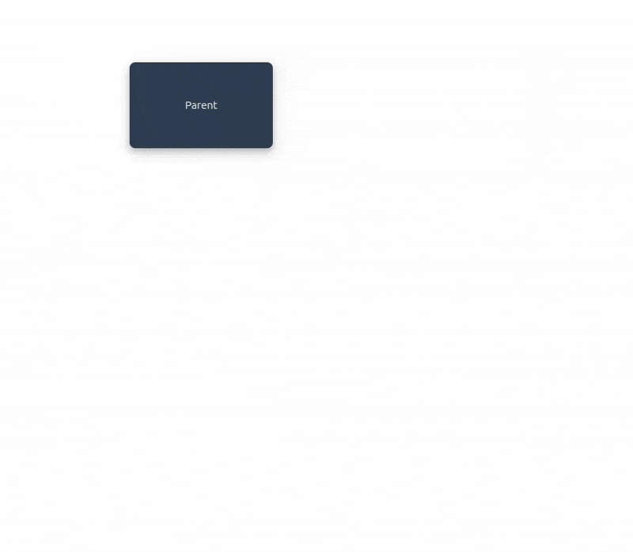

# Vue Hierarchy Tree

A Vue 3 component for creating interactive hierarchy trees with drag-and-drop functionality. Perfect for organizational charts, family trees, decision trees, and any hierarchical data visualization.

## Features

- 🎯 **Interactive Drag & Drop**: Move boxes around with smooth drag and drop
- ✏️ **Inline Label Editing**: Double-click to edit box labels
- ➕ **Dynamic Node Management**: Add and remove nodes dynamically
- 🔗 **Automatic Connections**: Visual connections between parent and child nodes
- 🎨 **Highly Customizable**: Extensive styling and behavior options
- 📱 **Responsive**: Works on desktop and mobile devices
- 🚀 **TypeScript Support**: Full TypeScript definitions included
- 🎪 **Collision Avoidance**: Smart positioning to prevent overlapping boxes
- 🎯 **Selection Highlighting**: Visual feedback for selected boxes

## Demo



## Installation

```bash
npm install @fabiomdf/vue-hierarchy-tree
```

## Basic Usage

```vue
<script setup lang="ts">
import { ref } from 'vue'
import { HierarchyTree, type FlowData } from '@fabiomdf/vue-hierarchy-tree'
import '@fabiomdf/vue-hierarchy-tree/style.css'

const hierarchyTreeRef = ref()

const initialData: FlowData = {
  boxes: [
    { id: 'root', label: 'CEO', position: { x: 200, y: 100 } },
    { id: 'manager1', label: 'Manager 1', position: { x: 100, y: 250 } },
    { id: 'manager2', label: 'Manager 2', position: { x: 300, y: 250 } }
  ],
  connections: [
    { start: 'root', end: 'manager1' },
    { start: 'root', end: 'manager2' }
  ]
}

// Access current flow data
const getCurrentData = () => {
  console.log(hierarchyTreeRef.value.flowData)
}
</script>

<template>
  <HierarchyTree 
    ref="hierarchyTreeRef"
    :initial-data="initialData" 
  />
</template>
```

## Complete Example

```vue
<script setup lang="ts">
import { ref } from 'vue'
import { HierarchyTree, type FlowData } from '@fabiomdf/vue-hierarchy-tree'
import '@fabiomdf/vue-hierarchy-tree/style.css'

const hierarchyTreeRef = ref<any>()

const initialFlowData: FlowData = {
  boxes: [
    { id: 'parent', label: 'Parent', position: { x: 200, y: 100 } }
  ],
  connections: []
}

const printFlowData = () => {
  if (hierarchyTreeRef.value) {
    const currentFlowData = hierarchyTreeRef.value.flowData
    console.log('Current FlowData:', JSON.stringify(currentFlowData, null, 2))
  }
}
</script>

<template>
  <div style="padding: 20px;">
    <button @click="printFlowData" style="margin-bottom: 20px;">
      Print FlowData to Console
    </button>

    <HierarchyTree
      ref="hierarchyTreeRef"
      :initial-data="initialFlowData"
      :show-add-button="true"
      :show-remove-button="true"
      :allow-label-edit="true"
      :box-width="200"
      :box-height="120"
      :enable-shadow="true"
      :enable-collision-avoidance="true"
      :highlight-selected-box="true"
      :show-buttons-only-on-selected="true"
      selected-box-border-color="#ff6b6b"
      :selected-box-border-width="4"
      box-background-color="#2c3e50"
      box-label-color="#ecf0f1"
    />
  </div>
</template>
```

## Props Documentation

### Core Data Props

| Prop | Type | Required | Default | Description |
|------|------|----------|---------|-------------|
| `initialData` | `FlowData` | ✅ | - | Initial hierarchy data with boxes and connections |

### Box Display Props

| Prop | Type | Default | Description |
|------|------|---------|-------------|
| `boxWidth` | `number` | `150` | Default width for all boxes (in pixels) |
| `boxHeight` | `number` | `100` | Default height for all boxes (in pixels) |
| `enableShadow` | `boolean` | `true` | Whether to show shadow effect on boxes |
| `boxBackgroundColor` | `string` | `'#42b983'` | Background color for boxes (CSS color value) |
| `boxLabelColor` | `string` | `'white'` | Text color for box labels (CSS color value) |

### Interaction Props

| Prop | Type | Default | Description |
|------|------|---------|-------------|
| `showAddButton` | `boolean` | `true` | Whether to show the add child button on boxes |
| `showRemoveButton` | `boolean` | `true` | Whether to show the remove button on boxes |
| `allowLabelEdit` | `boolean` | `true` | Whether to allow double-click label editing |
| `enableCollisionAvoidance` | `boolean` | `true` | Smart positioning to avoid overlapping boxes |
| `enableConsoleLog` | `boolean` | `false` | Whether to log changes to console for debugging |

### Selection Props

| Prop | Type | Default | Description |
|------|------|---------|-------------|
| `highlightSelectedBox` | `boolean` | `true` | Whether to highlight the selected box |
| `selectedBoxBorderColor` | `string` | `'#ffd700'` | Border color for selected box |
| `selectedBoxBorderWidth` | `number` | `3` | Border width for selected box (in pixels) |
| `showButtonsOnlyOnSelected` | `boolean` | `false` | Show add/remove buttons only on selected box |

### Label Editing Props

| Prop | Type | Default | Description |
|------|------|---------|-------------|
| `editFieldBorderColor` | `string` | `'#4CAF50'` | Border color for the edit input field |
| `editFieldBackgroundColor` | `string` | `'rgba(255, 255, 255, 0.9)'` | Background color for edit input |
| `editFieldTextColor` | `string` | `'#333'` | Text color for edit input |

### Add Button Props

| Prop | Type | Default | Description |
|------|------|---------|-------------|
| `addButtonBackgroundColor` | `string` | `'#4CAF50'` | Background color for add button |
| `addButtonBorderColor` | `string` | `'white'` | Border color for add button |
| `addButtonContent` | `string` | `'+'` | Text/symbol to display in add button |
| `addButtonSize` | `number` | `30` | Size of add button (width and height in pixels) |
| `addButtonShape` | `'circle' \| 'square' \| 'rounded'` | `'circle'` | Shape of the add button |

### Remove Button Props

| Prop | Type | Default | Description |
|------|------|---------|-------------|
| `removeButtonBackgroundColor` | `string` | `'#f44336'` | Background color for remove button |
| `removeButtonBorderColor` | `string` | `'white'` | Border color for remove button |
| `removeButtonContent` | `string` | `'×'` | Text/symbol to display in remove button |
| `removeButtonSize` | `number` | `30` | Size of remove button (width and height in pixels) |
| `removeButtonShape` | `'circle' \| 'square' \| 'rounded'` | `'circle'` | Shape of the remove button |

## Data Types

### FlowData
```typescript
interface FlowData {
  boxes: BoxData[]
  connections: ConnectionData[]
}
```

### BoxData
```typescript
interface BoxData {
  id: string                    // Unique identifier for the box
  label: string                 // Display text for the box
  position: Position           // X,Y coordinates
  size?: BoxSize              // Optional custom size (overrides default props)
}
```

### Position
```typescript
interface Position {
  x: number                    // X coordinate in pixels
  y: number                    // Y coordinate in pixels
}
```

### BoxSize
```typescript
interface BoxSize {
  width: number               // Width in pixels
  height: number              // Height in pixels
}
```

### ConnectionData
```typescript
interface ConnectionData {
  start: string               // ID of the parent box
  end: string                 // ID of the child box
}
```

## Component Methods

Access the component reference to use these methods:

```vue
<script setup>
const hierarchyTreeRef = ref()

// Access current flow data
const getCurrentData = () => {
  return hierarchyTreeRef.value.flowData
}
</script>
```

## Styling Guide

### CSS Color Values
All color props accept standard CSS color formats:
- Hex: `#ff0000`, `#f00`
- RGB: `rgb(255, 0, 0)`
- RGBA: `rgba(255, 0, 0, 0.5)`
- Named colors: `red`, `blue`, `transparent`
- HSL: `hsl(0, 100%, 50%)`

### Button Shapes
- `circle`: Rounded button (default)
- `square`: Sharp corners
- `rounded`: Slightly rounded corners

### Size Guidelines
- **Box dimensions**: Recommended minimum 100x80px for readability
- **Button sizes**: Range from 20px to 50px works best
- **Border widths**: 1-5px for optimal visibility

## Browser Support

- Chrome 70+
- Firefox 65+
- Safari 12+
- Edge 79+

## Dependencies

### Peer Dependencies
- `vue`: ^3.0.0

### Development Dependencies
- TypeScript support included
- Vite build system
- Vue 3 Composition API

## License

MIT License - see LICENSE file for details.

## Contributing

Contributions are welcome! Please feel free to submit a Pull Request.

## Repository

[GitHub Repository](https://github.com/fabiomdf/vue-hierarchy-tree)

## Version

Current version: **1.0.2**

## Changelog

### 1.0.2
- Enhanced TypeScript support
- Improved component props documentation
- Better collision avoidance system
- Selection highlighting features

### 1.0.1
- Initial stable release
- Core drag and drop functionality
- Basic customization options

### 1.0.0
- Initial release